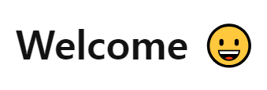

# 네이버 로그인 페이지 구현


---

로그인과 비밀번호를 정확히 입력했을 때 welcome 페이지로 넘어갈 수 있도록 코드 로직을 작성합니다.


---
- [x] 재사용 가능한 함수를 분리하고 함수를 중심으로 설계하는 방법에 대해 학습합니다.


---
1. 정규 표현식을 사용해 이메일과 비밀번호의 조건을 생성
2. 사용자가 input을 입력하면 조건에 부합하는지 확인하는 함수 생성
   
   * 조건에 부합하면 경고 메세지 제거, checkUser에게 true값 부여
  
   * 조건에 부합하지 않으면 경고 메세지 나타남
  
   * input 창이 비워지면 경고 메세지 사라짐
  
    
    ```javascript
    function checkEmail() {
      if (emailReg(this.value) || userEmail.value == "") {
        this.classList.remove("is--invalid");
        checkUser = true;
      } else {
        this.classList.add("is--invalid");
        checkUser = false;
      }
    }

    function checkPw() {
      if (pwReg(this.value) || userPw.value == "") {
        this.classList.remove("is--invalid");
        checkUser = true;
      } else {
        this.classList.add("is--invalid");
        checkUser = false;
      }
    }
    ```
3. 로그인 버튼을 클릭했을 때 조건에 따라 처리하기
   
   * 사용자의 입력 값이 정규 표현식에 부합하고, 미리 설정해둔 객체의 값과 같다면 다음 페이지로 넘어가기
  

   * 빈 칸인 상태로 버튼을 누르면 입력을 요구하는 메세지창 띄우기
  

   * 아이디가 일치하지 않다면 아이디가 다르다는 메세지창 띄우기
  

   * 비밀번호가 일치하지 않다면 비밀번호가 다르다는 메세지창 띄우기
  
    ```javascript
    loginBtn.addEventListener("click", (event) => {
      event.preventDefault();
      
      if (checkUser && user.id === userEmail.value && user.pw === userPw.value) {
        window.location.href = "welcome.html";

      } else if (userEmail.value === "" || userPw.value === "") {
        alert("빈 칸을 입력해주세요!");

      } else if (user.id !== userEmail.value) {
        alert("잘못된 아이디입니다!");

      } else if (user.pw !== userPw.value) {
        alert("잘못된 비밀번호입니다!");
      }
    });
    ```
    \+ preventDefault() 함수를 사용하여 submit의 기본 동작(action의 url로 페이지 넘어가기) 막기
 